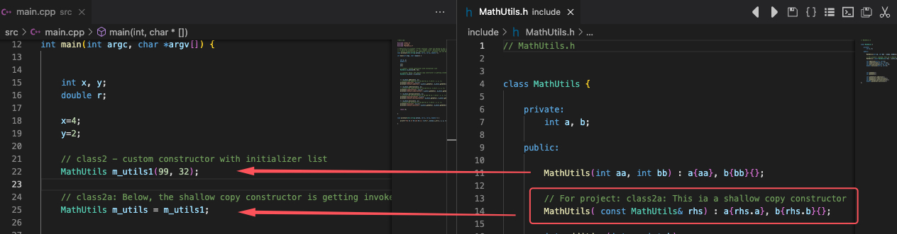

<h1 id="toc_0"><p style="background-color:purple; color:white; padding-left:5px"> C++ bunch 1</p></h1>

___

![](data:image/jpeg;base64,/9j/4AAQSkZJRgABAQEAYABgAAD/2wBDAAYEBAUEBAYFBQUGBgYHCQ4JCQgICRINDQoOFRIWFhUSFBQXGiEcFxgfGRQUHScdHyIjJSUlFhwpLCgkKyEkJST/2wBDAQYGBgkICREJCREkGBQYJCQkJCQkJCQkJCQkJCQkJCQkJCQkJCQkJCQkJCQkJCQkJCQkJCQkJCQkJCQkJCQkJCT/wgARCACWAJYDASIAAhEBAxEB/8QAGwAAAQUBAQAAAAAAAAAAAAAABQACAwQGAQf/xAAZAQADAQEBAAAAAAAAAAAAAAABAgMABAX/2gAMAwEAAhADEAAAAfPnXnyvBy50gTwtGQLe+Yq4hV2YbCzeiYtDUnV86rLHQON3cyTYHEJUegDJWkM72kyN/bTw1iDpkptbYwAGR8q7Q36R1Rg9TTlUNHkKvRNwfRdmcEnKXoYjj+dPGb04etWW4oXCcmwFiG7z9nbVS6uJ6rMkWlp88TdaId3lpik9yOoi1biDKXWCi2oikJ9Rl/U3njaWg8/m8l7OTzufbSo4aQ5gL7T9aJYDUgYkjsH0lnOaxNvKVoUtpc9t3Gfl3qmM020Pl3p/nS0DHa2knUbU2+UwBXy1orzcgNAhHaTFadhbfn4rxqKFCmNdVcBFJYkm9PsjFetPG5ltTzXdqRELaRiWrxWoyhwWvb1xx8mrsOnnK9KWHmLtHmZNZcnK12CQcr022WB+2emMILde5PSkFjOrnMpj/X8wpcFuRjq6uXqocauS77QfPMBVcXYDHpIZOfqJ2KxFQ9yny2c4WpVkOIBinu+YQ6MmpHRIYpWEis/H5nfbqMaM13Oqb10HZVjhEFLN9USyhuL8g5l+qFlOXfF9we868q6GzkSXJXkaS7qS2TkttRMlNozKU6ZwMl285tiXQleRJWupJ1//xAAqEAACAgEDBAEEAwADAAAAAAACAwEEAAUREhMUISIQBhUxMyAjJSQyNf/aAAgBAQABBQL46kznXMfjb4WPIl/u1Tcb8MyG5Dsh2Q7IdtneMxWp9IY1FBRMDgryEZ2u+dkWFTZGGEhiRyfDrKf9G/oqrFQNHtdSrp82V2dDtVVr0q6yWg1DEBLmto9OKg+OgURHUwOWU9N66i06RwqTMuafa51KD2QGkLljZ5tC22AlwOlXlt2IZToRtjh3uPrrBmoKiIT6BDiyLJZ3u2K1Tji9cmMjWlHiLFdjH6sos63PFzlNs4VdbIdp3RyzvFeh5gh/59n8OXBo22+N8pU1szStJpXyP6Qqzh/R5Z2/anEYODOKnaa7pzxMXyCtFZ1QB/o7i6SwUOoolUjvO3xW/XQ1Funto65afljVWrQORHwA+VeMAtiFu+W0Rarb8Dpc2MuUFvj7CuIv0IpFwnJzTvdZaZTOArDXsapcgYGyGdWOJHnfrCfvC8paqhmclmKy5De06e6XRmBZWZ0+3PoaqkhgEcUNQvNH8yryuy3hft/22JEMDlyNZZILwRDJXARpVqOnXtL3MNySE5tO+3n6l8CVcJi1TDNJ9LVf9F2CGzZ3Y3pZSq7lZRANfRIJ4eQHfKFdq2whWPuNB6/+z7AVhW0Gl9UfrX0jgqSWZqC6tO2q8gF2bapkhicgI5VCHDGJEilJwrq4pPTxLIjBKZhVnrPC9WgtSsodX05tarP1E5dhX3WxkavZjO8CZ7oc7ockvWDKIGxIwOoN3syborPzqYo/YJ4xaiUB1rOda1nK7ENTYcXEcgRwQDDSBYdSJglcML8yPlHAs44aCUfL0qftfO1fl6T1pyAtzn+htpzmtd1B36o4Lwx1njiC6ibMbEXLaWzuDZie4dM17RzPCJxC453rBrZJcpjjlSw1GTqVqJ0zy36g06nQxYwWdsU4VGx0KpQNSHzYyfhXHB4lkj5GMqhndsmx8I335zmmzsW8znOd8tf+Q+0I1K3oBR7DX5YFXaBCYzh6qjnNi1FJGqqGbNM+YZXCTMhITpTsWb462tEXddYyvvvi2ZB8h6k4p0xCyiZIt8UPHNW86YwZdNU4XJPHItBkW0zKrYhj9XWGfcpxryMmTv8AH4xbc54to4DYmVEOBPtqbY7e83t6i43ESKJKZz0cJU1lB/nJyf4LbtnDxG8Ygt8AuAzKyiw8rDa0+JnjJHvii8wOH+f50aUyAuFphsLIibB3LPVKZ9k+BZ8Ln2Nm0f/EACQRAAICAQMDBQEAAAAAAAAAAAABAhEhAxASEyAxBBQiUWFB/9oACAEDAQE/AaKfZbTo6jOqOaILAqH+MpnFnBjtPIlbPovebpiyJVtNWO0ZFX9Ot+FkiApslMuySxvDwIpmnEjChxsWmSRqRwqOLI+C0dRimORzOQ2S9TTwe5kKXLJYmJ5KRwQlR6i2qQ2LUZpv473ktF7T8mtCXL4o4z+iM2lVdli2m977Vgfjt//EACURAAICAgIBAwUBAAAAAAAAAAABAhESIQMQMQQiQRMUIFFSgf/aAAgBAgEBPwHIyRfeUatjowEq2icrlbHYl1kjMcVNNI5dR/1C+SHlvvjjkmSli6Y3fUXRqfk0P9I+l1F0TpuxxFEpEdMUt9MfU5DkJjmWQe9ia7kkiiihoSIen17j7eI446KHEx0JjkNnpaytlD4034OaPu6xZ8d+Diejhccfcyo/0T4rflHgb6aGM4I1sXgsxH+Hm7Et9fHTZ//EADoQAAEDAgIHBQUHBAMAAAAAAAEAAhEDIRIxEBMiQVFhcQQgMoGRFDRCYnIjMFKSobHBM4Lh8LLC0f/aAAgBAQAGPwLRmthxB5d1p5hVfL9u9Yrxz1usJo0Xt5tWx2XAflcstGa8SsQslcaGBOPHCsVCkPaHb5zWGrTfTF7wnv1kYG4ojmjVljmBuKyAbSzEi+aNOo0tcNya0mxKJDjZEplQc7aLrWFxAP4RK2X/AJhCtgPmv6Dz9N0YpkQb4rQtZUqExFgtZvTZZZvBAt37l2w8abv4TmfJC7Lf4FWHM/8AFVsLGtyyHRHDe2jxLNXAWZHQq9R3mtvAerUXa0CmLloWGkwhumLFZQVWc346bh1KrwcmLsp+X/qqo/3JVz8oKxYcwe5NQYpEqvTfRwGnEEOK2atVq2O1+rU6jrMeE59wKDo+1xampskjcmClUMNyRq68SdyqVC+A6nq/NNbjEhsWKzHrp/sP7J9SkGkuEbS28GXBPMNmNI7r6TviCiybids9UMRccXxb1OtqpsVC7Fx0geSb9nBi+EkIamMId8R5IUTq+Ows9AVzkrArbEFB9M20VSKZw4swqZa13hVPZylZfEqc8SmjVjK8o7IHRR8yZ0QYG1JzkMJ3Ko58zO+2jAFcxKzlZKQTPNFtRwbzlRjafNS02ddG/wDsnTR6rejtOuns4OCp/SEyoycTQnvyxOnRjcOQTXXwKW7QUGyjGeiaXm3BXpNPkmhlmzhhORqVDDQjgcHDkqXVeJvC6uGrs3swZBnGWmU1usbIRqNqNsBv66RKi11qjI4LesvPQERVAbgdM+acdcy/NODarHcpWDXDw2uYHJU9VUa8h24r3l695qL/AAv8LL9FOjgvCU2oWxh0wEOSrOYx1RzzNl7nVXulRSeyVQOJBWI0nei8IXhavC30QlqGEBqDCZVlPBWFxmoO9EgbKjehK6poZ2igPqddbPa+yg/WP/FbtXZj5hR7TRI6tTm1cDgB+ELNeJZoYR6oOOa8tAspaFMZFQ9WQTWMcWwNyl1yVdOFJ0A8ld3q1Pcd4VAdnpYS6SdolZKzHflTnupPDWXxEQsRyEpx3DRkslkpGgujK8BOdV+MzptZZ/oj0VyT1KiHddFfp/K9nYL4pLuSa8k3dlonEpzUI3UIPjZxgFbGVZuMcnKNEDNbVij00y434BP7O1jWtdnx0AcEChGi6gFQE/qF2c7mtxFTuUsaXN8lk70XjE81LXhRTGLmpEAouPemVY6alPjkm0x46oE8mpysgUBU9d62Kpb1+4usYy0yvaK16dPd+Io1Hm57u0c7/ctfri3HuAlGm5m2LSFkm0gcPNBrBhpM8LVHe//EACYQAQACAgEDAwUBAQAAAAAAAAEAESExQVFhcYGR0RChscHh8PH/2gAIAQEAAT8hCGM1dQN0wS2AptEtjDcoTvAlbH7pS6av8H0u5O79MJcuh7MKKUenzS8bMp8EaCWW5R9GdAV4lfQgN3t2J0qekv25w18MepiX29CeBU/eGfx8IYoq47u2p3n5vov4gWDSy10D9xyBFlTWOPWM1z3AoR09UqMMAGJxhLTzDt+I0NtQlyenrB0kHQiFdKqPfkqO4Xy/KU8/CYEIF5H6w62JwUzn1qOClFdVR1hvQcKb6QzyRnaMA5bb4jMAGj6oBKt9K6li1lX3JZgJp9UQswygoIuYcvpFQesFAuD6QWzmPSzAw3y90KoRFBikJCqS7biuSE4PzCJUejLcd8YqAbbgTkP5O6hH0Z6fF+r4lGhmddx/r7RcDkYO84pbFSrz7RUDHaK7qMh3e3x7z8lh8ToL1v3L0S6J0vb6LqZiYhKVtxKSWMbVp43LP9j4HKR4qW/HWdPMwWuWVyz95SfS6KuyuZaU/j6CRinr+XNOI1YZlDlXhXNs4Y4JeFmbnmDUwPdARmDBcxsExqcG5p+9l4i0xVKNk5z/AFLW/qCM8LfSKlnNFJ8QBLtprXzEIJk3eWymsA184gprG4T/AKmZBd23tuXawhqt3BLrqUFi9EAYkS6CQSpXvPMVcJ0GJRTBHGm2UITS1cZlpMaX4jEr/hAWz2pzcpuwdU9lzNdS/acwNr2mq3HbVaY29SHcXKClzG1nmZuSj3aDQt6imI4QqYtxMCW4zoNwGq83jfqQu5PaDuWX4gvNbTexB2A0dSgDilfmH/NxAMVqgu7v4mb25TpbMm8+ZYOLMnSICjw9pvm+8z4qKC5eCl3KmByDBDuBc5tKc1HYmI/7bOQwPtEAIVasm3/uGXdLS4KuYB9/7rBS4rfLN5j4qaczTSrG7P6JsQZSUGJZEuwIFVLy1FoeIZu096gO6LCJZZz2lDekLJWtMHKIiulSQwTIydQ4tJVFl3Rau/zBrNAJTDKW8vj+RIXFxOoT2I/0EHDpiB6zqB0hQWeswiB8wqrmOHaWdYTKtC2DHQq6tuo+c/3Sf7X4j4uoPxLfNlbMb/0z+OJ/BIcg9MT86DcbQHPWMAdWIFA2q0m+AnsvcXRRhqJkpvtFsjbBcGha1rtBUfrJSHpqVPKIPsz/ABwT40s/UXZH57OhHiYDsTuUSvy1YlXtevMoKNxQHdMBZVO+4zQrjMptgPtCYCcibIgwAqobNzcQH5lpuWLWLV2wJ4EtVznB/TFAFcU/EvvCL7zevroFVt7s7l8Sk6/Am4o7+iV0zCy1lPrEecA7Qo0Shr9or8oQtAxWlzUwnWIUPHAy9pWzcOkKQTTCUNSq2F19mZ6bQEbGv+rL9407gngS5VN5H4TnE7Hs94dhCurqsYxJWtS+0x5J6MgbnTtLSpeqJkkDNdRlyAalp3Xn9zKOlypiXji9RgHsBX0kGeE8XTMs217OYdkSn1eplmusLLKIApu+Jl4PMyDbplXJaZ7yo+RPZJjJaToRrx3L3QVu35m9X7vxMq9YibY1W4nmerBE3zgz+WKxaty/cIKrJx3TDt9SB5ez9GGpc7apeTgj5EHDu9P6TFpWMIZFp5ljCpo4Esig0mccXiKK361EdZnWDaGcHBNHXeb9ceZJj25LbC34mR0mngCYsxNhb6JnH1ZcJzKLBV3zBHlq0NRUyK0hy9kJmxE+694rTBi7TJi1iUiAdlz/2gAMAwEAAgADAAAAELuLQxF7oeg30tcoUDAZjWV4mC/zAm8FgTnj0mQ2s7NYaZBccUAHaavcf4pKQ/5gOTcxWAf3vf1PQDhdcFVY6qfd7lDgn/X4/PQgPP/EACIRAQEBAAMAAgEFAQAAAAAAAAEAESExQVFhECBxgZGhwf/aAAgBAwEBPxBfRPtJNqAHqTiGycvtK4TuUIOQJ3ZTIfmlHAl7koCPwf8Ab390gQ+44MnbAi4z2zBMEAuPcnry9zr33GyZYaxR0tmMhwW/VpEsgd5ZKc5O6sK2KYPMIXEDm+huGG+Ij2ke7H2B6wE224uIfH8X2P8Ali5/hz8xGZrTpgnyLIOMEwbjfgeRtOoYkFu9QjNaFj27dH/VmwZ1+CreY6tnJ7suPsfoSgJ5O728gL//xAAkEQEBAQABAwQBBQAAAAAAAAABABEhEDFBUWFx0ZEggbHB8P/aAAgBAgEBPxAHdiCbbzrcziyBNX2geLdpiW5yvrBSDqQnpIGyLhI2L/k8X8H1FVds/tnF2LhXfYU7xbN6ItjtHchPjvPy4fF8oMlLkdDvDmkb3kvEp0x0fMG3jiywmTJC4IS3PVIF2TeZH1htgZpG72lg3JxGlHP7/Vj6fl+rZx6TTmeVPHQw8WkRUKcWkQ9TobIGJEkWcHMzGYwfid9BcsfkhOOSvfoLHI82LV2GwuNl5y7/ANGZXhAnbMMOjeZNv//EACYQAQACAgEEAwEAAwEBAAAAAAEAESExQVFhcYGRobHBENHw4fH/2gAIAQEAAT8QhZFgV0cwQlui9S1OCOYcN1x2l4mBbi8MAicFSP8AQkHrgv7CcrqNNZmhzHIq2pYmbiDZEBnE0MJ2Yof1HcxwhXraAfURBbK+gY41DoceBmHlVuVNvbsdok0bYyUVrJKnOOBx+oi+Ss/jB1A9n+1FiHvGxdieePupU/VX3j9BHYqplFYIe79Qr+7dXsJeSEybqa3y1IKgsazhvmL6S4ImXeMJ1x7iESDbWWRx3cMSXWY2xSu+zE0uNtHsmH1E7KbZpagNUsKNG/HSGCvj+v8AJXhuaKVl4DavD0lrR5JbK17ReeB1iKJe5jWcSiC8/wAGkWxbsv2ooGqKD5vKzkmfRQtm+DedSoxIQgDKtyjoJWYTqFrCiWIG6Ewcl6bqtG4aFbY0MH3pgPFENCmTsqxunQz8TMLb87H+EJu2UXdxMJdskMcXfzCVBJ2qcfLMD5cpT03zmJ2+VCp9jFbJcCQ6X0lSD+P7lSU7cn1FfLgAaoxe0wbuZlmDAO5mv0Kc1K3DDz1TigLVn5gcoGDsvEMdw8lFXhwJo89otp+EaSWCejg+YZktkIdUf2PB2o28VDrLc2dRGjBKxU7c6ON1gKuieQvzF4zcRubL0wzVM5hKvcUx9qGtrcH6gQQQXpDYadDJKq6QSFRGpojZwd2RBrw3tjoQNMVR7xFKCuQRyB/JmM2MffJE4YpGBt4sDHpBlC4eqpZw6fEYBBVNIjbQ7OYjCFsQZ4f4SNkp+6ZeYisBRsBM4+5SLIQ0Hd6BE6NhwcATPC36m+lVasCW2guNB8IKEGmFjHDBakHL2ZRJuCb7rwJsMo7iDL1I6tARuqjxPlXlUWVhtKhTgcNDWkqrqdymgoS0VrzynT3ATpcIxFvn0hOQ+Ys5C3X3EP2KGnqAaq22cqbzeiULaVtGyq1XOpdLBvNbBKi9rR03HDK4viMdNgGZhwA39Q5YBT6hy+7rvUCz+kdzbTRMI94V/gV5QQ+4JV5lr9AtKCmjELWcIO1i78warFZ4KdIQe5lK1jrlsORsBmbE8S5SK5AMTAWa+NqU/wDmsldxXWkHiMsgujm9TehthRoKCmgsqAyl6jFwbJbGvKwVRDfJnJDKReLC/qAAd/7vKYaoFD2P92/2Y4ZdkJxd7zqZ0jyQ+KhUJrpNkq7E6GohQbWLdrw3EU3aVScd4EA0vo0Gr7RQerg7f+SiUq1jH1EKiUD/AKS9BGWyDI7dd/xw2qipCtKMuthlBAWo1CKMq3FF65j0BysRhAANjk13ZVwYpdO+el39RJzShoDz3JUkUKpKYcA0TR4LqWvSIKeQ3+S48W6/zBNGzCjoK7gw9kT7T+y74AXlJ6zDfiR7HOztPTI+f9EYhmMUhqy3J0Z8X0n2CLo9OqV7Vt29ekr1KWhWN6YsQkI6s4Bv0cy3uOqZ+ZjGFa1CNAazG/fVNlTcayy/DW+0M+Ov4I6tRTsna2IJYwdXU6R1ZxwjdQdwDx3BZMrpqDgzjiX4KgL3gBm8TjFZmSZBAu9sEswihtq7rWZgB9SL+4crFdAp84hTAlYDOfrONTAFhose0MINrBl/bpvZvwxgk0JZ/IlpCt2tN9NfcCbBpcqzapuMLWWTOO6XRqBtaMo75oG2YYWCwpydpalqDa6S6p+0AHW5tOqCAo9d/uGpd5LMHJf/AFqbQb1/8pZpg8h9VM4hlVVbXMPMFFBVOn8lygKLdi4nhFIEs/8AIdPZlloMPdxlIyKSkyN/C+BYqyprlvWKUdXqXAWQXoy0a0yZcLr1KQcVLqDMx56x74Nkx0pgxTObc5M3aN9wh4CgCpWIXzFj9JrwrggcVR0bmeOxwXx1gBbItWEfyI2jkfcNiMinpVRaduasW9dJfkqgdKOfivZDBw3eVRV9MmffzgYALojdf9+zBJUIYMzOBwsZCtmPEHBFZVyqxO0ZscHVFyreWHwPWBfq4q5AhcTVikSps4GzrpMDscAFpXEbzPFTRGYgYWFWAJbg2WrHy4DUyqSeNgdC3Zq8ndZc5z6AOIawD6G8fUc1DpHpBVtulIU2W97qVkjtUeAL4OL/ANTeVgNj9n7HFY6QuGByrqu5Cloyq6XVD21WysxrdlY/4uzcFwB6gkEqqqWjxyTPf/UmYHX+xJYbPAQnic3frmGWYNNBYBU30ZyD9nwStEFOqAB4HHuOLi+ajXnpZQT6q4b8Q1VF52vSMr1sfCOIwoNsw3fT+TkbDC4D6Q+ZjRamgfBgX1VKlclGK8/92lSKK6ayOHURuUDFyAegxHy3f9IPf4Z2r8mZNXYEenHlgl2C2wIlOA10Y4U7lvbpHoLf6wBcRo8zYBM1yyuynZq+xCw0uFFD5/7cViqAUrZV15q4F4ACW2mi+mIOHR7Kj6WPUCHaMKr2iyt0Bppx/YRpgNAMZsRzCcLyVHtJPMoEHxmXRqy+HvxEKNDf6Tb9R/ibQqzvZFR2xeZQ8qmKnDL2ZIXWMU8wt2SqsyQwtA5HXOoMMFnGvFxbaqu7te8B2Q5uHr/aCj9j2HaVBjtb6GIZaB7OY0ZV3ZqJABwNPqG6FjQ6Xmzsw7hAXj2CmZsubRN/54rTFDfSCP2BDFpQU4eGEXZrkimyI4O/MZ21WFhhlK/l7obf9XMqxgOBwHYMQm7Y+YdIC3c4HMYuLI7ZCN6qzK0eIlxzK5ggjGyCPqvaVQvIW2XVe4vjNz05rZqEREp+l2kBbXetQn9rFt3pbTNYrcsGh8IDVk5iJWZRA5giqtn/2Q==)

(C) Prepared by Panaos Zafeiropoulos 

___

## Start learning C++ classes

This is a bunch of tiny C++ projects for iroductory/learning purposes on C++ classes.<br> 
**makefile** is included in each one of the projects. 

Find the souces [here](https://github.com/zzpzaf/cpp_bunch1_learning_classes).

# <h1 id="toc_0"><p style="background-color:DodgerBlue; color:white; padding-left:5px"> class1</p></h1>


-A very simple example of a basic class declaration and definition.
-Declaration is separated and takes place in a header file, and Definition in a source code file.

___


<h1 id="toc_0"><p style="background-color:DodgerBlue; color:white; padding-left:5px"> class1a</p></h1>


An updated version of the <span style="color:lightgreen">**class1**</span> project.


### Updates only in the main class: __main.cpp__

- We use command-line parameters/arguments as input values for our variables (the 2 integer variables for calculation). 
- We also use another "free" function (available only in main.cpp) for outputting the passed-in arguments.
- We use only the first 2 parameters as input values for x and y variables.

___


<h1 id="toc_0"><p style="background-color:DodgerBlue; color:white; padding-left:5px"> class1b</p></h1>


An updated version of the <span style="color:lightgreen">**class1**</span> project.\
However, this is actually a sequel, based on the previous project: <span style="color:lightblue">**class1a**</span>

### Updates only in the main class: __main.cpp__

- We added user interactive input for input variables (comma separated integers), if no command-line parameters/arguments passed-in with the executable execution. 


___


 
#  <p style="background-color:DodgerBlue; color:white; padding-left:5px"> class1c - "Passing by Reference" function</p>

An updated version of the <span style="color:lightgreen">**class1**</span> project.
However, this is actually a sequel, based on the previous project: <span style="color:lightblue">**class1b**</span>

___


### Updates only in the main class: __main.cpp__

- We added a "free" function, named "getintegers". It deals with the interaction with the user for providing (or not) the 2 (comma separated) integer values. Thus we avoid having some boilerplate code in the main(). 
- The function <u>uses arguments passed in "**by reference**"</u> (C++). The __&__ (address of) operator denotes values passed by "pass-by-reference" in a function.
- Passing arguments "by reference" in a function, means that inside the function we can change the values of those parameters. The function does not preserve their values. So, the changed values are reflected into the calling scope (e.g. in the main() function in our case). Thus the "getintegers" function can return nothing. It can be just a void function.
- One more note is that in pure C there is no such "pass by reference" functionality. In C, __&__ means "address of" and is a way to formulate a pointer from a variable.

___


#  <p style="background-color:DodgerBlue; color:white; padding-left:5px"> class1d - "Passing by Const Reference" function - return an integer array (actually a pointer to an integer array)</p>

An updated version of the <span style="color:lightgreen">**class1**</span> project.
However, this is actually a sequel, based on the previous project: <span style="color:lightblue">**class1c**</span>

We added another free function "getintegersarr" which is an alternative to the previous "getintegers", dealing with the interaction with the user for providing (or not) the 2 (comma separated) integer values. This time we use "pass by **const reference**", and the "getintegersarr" returns an array of the 2 integers.

Overloading could have been a good option, however the previous "getinteger" function cannot be  overloaded, because it was a void function and moreover, its signature/prototype remains the same, even we use the const modifiers. So, we use the new "getintegersarr" function.
___

### Updates only in the main class: __main.cpp__


  
- The "getintegersarr" function <u>uses arguments passed in "**by const reference**"</u> (C++). Generally, passing an argument by reference, is considered more efficient. However, when we want to ensure that the arguments passed in will not be changed, then we can pass them <u>"by const reference"</u>. The **const** modifier ensures the value of an argument will be remained intact.4

**Some notes about the "getintegersarr" function** 

- We want to use "pass by reference" for efficiency
- We want the parameters passed-in to remain unchanged. Thus, we use the **const** modifier.
 
- We want to return an array. However -generally-, we cannot return an array from a function.
- A first commonly used approach is to return a pointer, pointing to the integer array, that the function returns.
- Here we use a local **static** variable for the array to be returned.
- There are also other approaches for returning an array - actually a pointer to array, e.g. by using dynamically allocated array: int* arr = new int[2]; 
however after calling the function and getting the returned  array, we have to clear it, e.g. by using the delete or free(), in order to avoid memory leaks.
- Using a local static array is a preferable approach. This is because the lifetime of a static variable is throughout the scope it resides, and here the scope is within the function. Thus there is no need to delete or free the array and its memory allocated.

__


#  <p style="background-color:DodgerBlue; color:white; padding-left:5px"> class1e - "Passing by Const Reference" function - Using a struct wrapper to return an integer array</p>

An updated version of the <span style="color:lightgreen">**class1**</span> project.
However, this is actually a sequel, based on the previous project: <span style="color:lightblue">**class1d**</span>

Here, we use a very very simple struct, as a wrapper of an integer array of (fixed) size 2. This is the array actually holding the user input. In the main, we use a new free function of type of the struct, that it returns the array of the user input, wrapped in the struct.

##Short intro to C++ structures - <span style="color:red;"> struct </span>
In this version we use a  <span style="color:red;"> **struct**</span>.
**structs** in C++ are classes that by default use public access modifier for all of their members (variables, functions, etc). A **struct** is a user-defined data type that combines logically related data items of different data types like float, char, int, etc., together. Moreover, it cannot have null values.
A commonly used approach ****is to use structs as **POD**s (C **Plain-Old-Data** structures).  A struct with no modifiers or methods is a C POD struct. This gives C++ a backwards compatible interface with C libraries. <i>"A POD-struct is an aggregate class that has no non-static data members of type non-POD-struct, non-POD-union (or array of such types) or reference, and has no user-defined copy assignment operator and no user-defined destructor."</i>
A struct instance is considered as a “struct variable”


___


# <p style="background-color:Blue; color:white; padding-left:5px"> class2 - class constructor with member initialiser list</p>


A second example based on <span style="color:lightblue">**class1**</span> project.
___
In this example we use a class **<span style="color:red">custom constructor</span> with parameters** in the header.
The constructor initialisation uses member initialiser list.
A **member initialiser list** starts with a colon, followed by member names and their initialisers, where each initialisation expression is separated by a comma. 

In our example, this is how we declare an initialisation list: 

```MathUtils(int aa, int bb) : a{aa}, b{bb}{};```

This is the preferred way of initialising class data members.
-No need to do anything else in definition code.
-We can invoke the class like that:

```MathUtils m_utils(99, 32);```


___


# <p style="background-color:Blue; color:white; padding-left:5px"> class2a -  Shallow copy</p>

An update (first update) based on the previous <span style="color:blue">**class2**</span> project.
____
In the previous example (**class2**) we used a (public) class **custom constructor with parameters**. The constructor initialisation used a **member initialiser list**. (We declared/defined it in the header).
____
In this example we add a **<span style="color:red">shallow copy</span>** constructor.


The copy constructor has a special parameter signature:

```
MyClass(const MyClass& rhs)
```

In a case where we use a custom constructor with parameters, the shallow copy constructor looks like:

```
MyClass(const MyClass& rhs): x{ rhs.x }, y{ rhs.y } 
```

___


# <p style="background-color:Blue; color:white; padding-left:5px"> class2b -  Deep copy</p>

A second update based on the previous <span style="color:blue">**class2**</span> project.
____
In the previous example (**class2a**) we used a (public) class **custom constructor with parameters**, and a Shallow copy constructor. 

Here we are going to use a pointer member parameter - int \* p

Then, the 'regular' constructor initialisation using a **member initialiser list** is similar to:

```MyClass(int xx, int pp) : x{ xx }, p{ new int{pp} } {}```

The **<span style="color:red">deep copy</span>** constructor has a signature like the one below:

```MyClass(const MyClass& rhs): x{ rhs.x }, p{ new int {*rhs.p} }```


What actually have to do is to use the **<span style="color:red">new</span>** keyword, to allocate a new memory for the pointer member parameter

___

