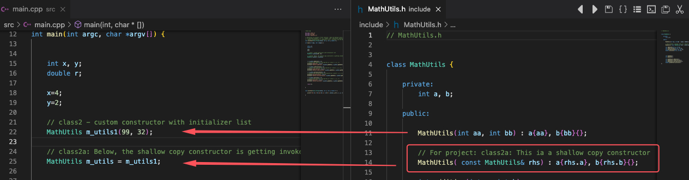

# <p style="background-color:DodgerBlue; color:white; padding-left:5px"> class2a -  Shallow copy</p>

An update (first update) based on the previous <span style="color:blue">**class2**</span> project.
____
In the previous example (**class2**) we used a (public) class **custom constructor with parameters**. The constructor initialisation used a **member initialiser list**. (We declared/defined it in the header).
____
In this example we add a **shallow copy** constructor.

The shallow copy constructor has a special parameter signature:

```
MyClass(const MyClass& rhs)
```

In a case where we use a custom constructor with parameters, the the shallow copy constructor looks like:

```
MyClass(const MyClass& rhs): x{ rhs.x }, y{ rhs.y } 
```


